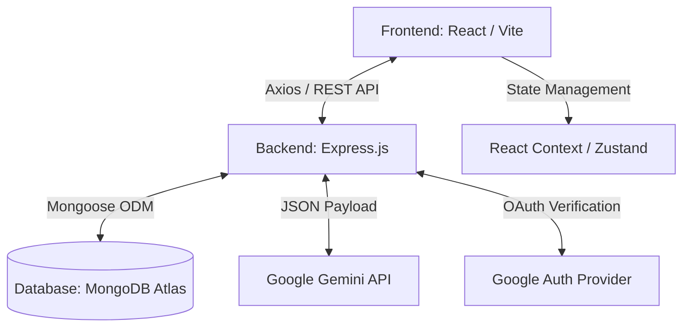

# CAMPUSHUB
### AI-Powered Student Productivity and Collaboration Platform

---

## 1. Title Page

**Project Title:** CampusHub  
**Tagline:** "Empowering Collaborative Learning with AI"  
**Project Type:** Full-Stack Web Application (MERN Stack + Gemini AI)  

**Developed by:** [Your Name / Team]  
**Date:** [Submission Date]  
**Institution / Organization:** [Your College / Organization]  

---

<br/>

## 2. Abstract

The modern educational landscape requires efficient resource management, instant access to information, and seamless collaboration. However, students often rely on highly fragmented toolings—using different applications for file storage, note-taking, assignment tracking, and communication. **CampusHub** is a comprehensive, AI-powered student productivity and collaboration platform designed to unify these activities within a single, highly intuitive application. 

Built on a robust MERN (MongoDB, Express.js, React.js, Node.js) architecture, CampusHub provides a scalable and secure environment for academic workflows. The most defining aspect of this platform is its deep integration with the **Google Gemini API**, which transforms the tool from an organized repository into an active, intelligent learning companion. It introduces features such as a real-time AI study assistant, automated quiz generation from lecture notes, and native note enhancement. This project report outlines the system's architecture, database schemas, AI interactions, UI/UX methodologies, and the full development lifecycle from conceptualization to production deployment.

---

## 3. Introduction

### 3.1 Background of the Problem
The transition to digital learning environments has generated an unprecedented volume of academic data. Students are required to navigate hundreds of PDFs, manage dozens of assignment deadlines, and consistently synthesize complex lecture materials. The lack of a centralized academic ecosystem often results in cognitive overload, missed deadlines, and suboptimal learning outcomes.

### 3.2 Need for the System
While standard Learning Management Systems (LMS) excel at administration, they often fail to enhance the *student's* actual study experience. There is an urgent need for a student-centric platform that not only stores information but actively helps the student digest it. A system that can summarize text, test knowledge, and track academic momentum in real-time is no longer a luxury but a necessity for modern education.

### 3.3 Objectives of the Project
- To develop a centralized hub for managing notes, assignments, and study materials.
- To seamlessly integrate artificial intelligence capable of contextual assistance, content generation, and peer-like tutoring.
- To implement a highly responsive, mobile-first User Interface (UI) that provides an engaging, low-friction user experience.
- To support robust, zero-trust authentication via seamless OAuth 2.0 and JWT implementations.

---

## 4. Problem Statement

Students universally face a set of core operational bottlenecks during their academic careers:
1. **Resource Fragmentation:** Course materials, personal notes, and deadlines are scattered across Google Drive, local storage, WhatsApp groups, and university portals.
2. **Static Study Materials:** Traditional notes and PDFs are static; they cannot interact, explain themselves, or adapt to the student's level of understanding.
3. **Delayed Assistance:** When students are stuck on complex topics during late-night study sessions, professors and peers are often unavailable.
4. **Poor Organization & Tracking:** Manual tracking of assignments leads to procrastination and missed deadlines.

---

## 5. Proposed Solution

**CampusHub** addresses these challenges by merging productivity infrastructure with generative AI. 
- **Centralization:** CampusHub brings tasks, notes, and curated materials under one roof. Working within a unified environment drastically decreases context-switching.
- **Dynamic Interactions with Data:** Through AI integration, notes are no longer static text. Students can ask the AI to "summarize this module," "generate flashcards," or "explain this concept like I am a beginner."
- **24/7 Virtual Tutor:** The embedded AI assistant provides immediate, personalized conceptual clarity whenever needed.
- **Modern Gamification & Tracking:** Progress is quantified through XP, streaks, and clear visual dashboards, turning productivity into a highly rewarding activity.

---

## 6. Features

### 6.1 Securing Access (Authentication)
- **Email/Password Login:** Using strictly hashed credentials (bcrypt).
- **Google OAuth 2.0:** One-click, frictionless entry into the platform, avoiding password fatigue.

### 6.2 Intelligent Assignment Management
- **Dashboard View:** Visual tracking of pending vs. completed assignments.
- **Priority Scaling:** Users can categorize assignments by urgency to manage their time efficiently.
- **Status Toggling:** Kanban-style or checklist functionality to monitor pipeline progress.

### 6.3 Study Materials Repository
- **Centralized Vault:** Upload and access PDFs, slide decks, and reference links organized by semesters and disciplines.
- **Rapid Search:** Fast indexing to fetch specific subject materials in seconds.

### 6.4 Public & Private Notes Engine
- **Markdown Support:** Write clean, brilliantly formatted notes natively in the browser.
- **Privacy Controls:** Users can maintain a private digital garden or publish notes publicly to assist peers.
- **Social Interaction:** Upvoting and bookmarking high-quality public notes from top students.

### 6.5 Generative AI Capabilities (Gemini API)
- **Contextual Study Assistant:** A chatbot uniquely aware of the academic context, capable of breaking down complex theorems or code.
- **AI Quiz Generator:** Automatically parses user notes and creates multiple-choice quizzes to enforce active recall.
- **Notes Enhancement:** AI tools to format unstructured brain-dumps into neat, structured study guides.

### 6.6 Progressive UI / Gamification
- **Beautiful Dashboards:** Glassmorphism UI components detailing user stats.
- **Mobile-first Flexibility:** Flawless experience shifting smoothly between desktop monitors and smartphone screens.

---

## 7. System Architecture

The project employs a decoupled **Client-Server Architecture**, specifically leveraging the MERN stack with external AI Microservices.

### 7.1 Architecture Diagram Example



### 7.2 Frontend Architecture (Client)
- **Framework:** React.js bootstrapped with Vite for instant HMR and optimized builds.
- **Styling:** Tailwind CSS to enforce a highly uniform, utility-first design system without bulky CSS files.
- **Animations:** Framer Motion enables fluid transitions and micro-interactions.

### 7.3 Backend Architecture (Server)
- **Environment:** Node.js runtime executing Express.js for routing.
- **Design Pattern:** Organized strictly under the **MVC (Model-View-Controller)** paradigm.
    - **Models:** Define the exact shapes of MongoDB documents.
    - **Controllers:** Handle core business logic (e.g., verifying user XP, triggering AI endpoints).
    - **Routes:** Orchestrate URL paths to specific controllers.
- **Security Middleware:** Protection modules include `helmet` (HTTP headers), `cors`, and JWT-validation blocks.

---

## 8. Database Design

CampusHub uses **MongoDB**, a NoSQL document database, suited perfectly for managing scalable, unstructured data like rich-text notes and serialized AI interactions.

### Core Collections & Schemas

#### 1. `Users` Collection
| Field | Type | Description |
| :--- | :--- | :--- |
| `_id` | ObjectId | Unique identifier |
| `name` | String | User's full name |
| `email` | String | Unique email address |
| `password` | String | Bcrypt hashed password (if not OAuth) |
| `googleId` | String | OAuth identifier |
| `xp` | Number | Gamification experience points |

#### 2. `Notes` Collection
| Field | Type | Description |
| :--- | :--- | :--- |
| `_id` | ObjectId | Unique identifier |
| `authorId` | ObjectId | Reference to `Users` collection |
| `title` | String | Header descriptor |
| `content` | String | Markdown formatted payload |
| `isPublic` | Boolean | Access level toggle |
| `upvotes` | Number | Community validation measure |

#### 3. `Assignments` Collection
| Field | Type | Description |
| :--- | :--- | :--- |
| `_id` | ObjectId | Unique identifier |
| `userId` | ObjectId | Reference to `Users` collection |
| `title` | String | Assignment designation |
| `dueDate` | Date | Expiry timestamp |
| `status` | String | Enum: 'pending', 'in-progress', 'completed' |
| `priority`| String | Enum: 'high', 'medium', 'low' |

---

## 9. API Design

RESTful endpoints operate via stateless HTTP requests. Below is a subset of core APIs defining the CampusHub backend communications:

### Authentication API
- `POST /api/auth/register` – Accpets payload, hashes password, generates JWT.
- `GET  /api/auth/google` – Initiates Google OAuth 2.0 handshake.
- `GET  /api/auth/me` – Validates JWT in headers, returns current session user data.

### Notes API
- `GET  /api/notes` – Evaluates queries (public=true or userId=XYZ) and returns paginated documents.
- `POST /api/notes` – Creates a new note object string.
- `PUT  /api/notes/:id` – Updates specific note text or visibility status.

### AI Integration API
- `POST /api/ai/chat` – Relays prompt history to Gemini and retrieves conversational output.
- `POST /api/ai/quiz` – Posts raw text to Gemini with specific JSON-schema instructions to yield structured quiz data.

---

## 10. AI Integration (Google Gemini)

The defining paradigm of CampusHub is its use of Large Language Models (LLMs). The backend interacts securely with the **Google Gemini API** to abstract heavy intelligent processing.

### 10.1 Structured Prompt Engineering
To ensure the AI returns usable data rather than raw conversational text, Backend controllers wrap user requests in restrictive prompts. 
*Example for Quiz Generation:*
> *"You are an academic test generator. Extract the key concepts from the following text and generate 5 Multiple Choice Questions. You MUST return the data STRICTLY as a JSON array of objects with keys: 'question', 'options' (array of 4 strings), and 'correctAnswer'. Do not include markdown block formatting in the response."*

### 10.2 Chat Assistant Memory
The backend API accepts an array of previous messages, simulating stateful "memory" for the AI during a session, allowing students to ask follow-up questions without losing context.

---

## 11. UI/UX Design

An application designed for students must feel modern, frictionless, and encouraging.

- **Mobile-First Approach:** Utilizing Tailwind's responsive prefixes (`md:`, `lg:`), the platform ensures every table, dashboard chart, and markdown editor collapses cleanly into tap-friendly interfaces on mobile devices.
- **Glassmorphism & Depth:** The UI utilizes semi-transparent backdrops (`backdrop-blur`), subtle inner shadows, and vibrant gradients to form a "glass" aesthetic that feels technologically advanced.
- **Component Reusability:** Every button, modal, and input field is abstracted into highly modular React components, ensuring a cohesive design language across the entire platform.

---

## 12. Implementation Details

- **State Management:** Using React Context for global user states (Auth, Theme) to avoid aggressive prop-drilling, while local states manage specific component behaviors.
- **Error Handling:** Centralized async middleware is used on the Express server to beautifully catch crashes and return formatted JSON error messages to the frontend.
- **Data Fetching:** The frontend utilizes `useEffect` hooks heavily alongside Axios interceptors. The interceptors auto-inject JWT tokens into every request header.

### Key Challenges & Solutions
- **Challenge:** Google OAuth redirecting into infinite loops resulting in session invalidation.
- **Solution:** Aligned frontend routing with backend callback endpoints, utilizing secure HttpOnly cookies or strictly managed local storage tokens synced through React Context.
- **Challenge:** AI responses breaking the frontend parser when returning improperly formatted JSON.
- **Solution:** Implemented backend RegEx sanitization tools to strip out ` ```json ` markdown codeblocks generated by Gemini before executing `JSON.parse()`.

---

## 13. Deployment

CampusHub is built for high availability and continuous integration pipelines.
- **Frontend Hosting (Vercel):** Connected directly to the GitHub repository. Every push to the `main` branch immediately triggers a lightweight Vite production build, distributed across the edge network.
- **Backend Hosting (Render):** Express Node server hosted in an evergreen container, automatically waking to handle API influxes securely scaling with demand.
- **Database (MongoDB Atlas):** Fully managed cloud database clustering, providing network isolation and deep performance metrics.

---

## 14. Testing

Extensive testing was executed to assure platform stability under academic loads.
1. **Functional Testing:** Form submissions, valid and malicious JWT tampering, password edge cases.
2. **API Endpoint Testing (Postman):** Assured every API correctly returned 200 (Success), 400 (Bad Request), 401 (Unauthorized), and 500 (Server Error) status codes accurately.
3. **Responsive UI Testing:** Utilizing Chrome DevTools to mimic iPhone SE, iPad Mini, and 4K displays to patch CSS overflow anomalies.
4. **AI Output Validation:** Verified that edge-case prompts (empty text, gibberish) gracefully fall back to default error messaging rather than crashing the React DOM.

---

## 15. Results

*Note: In actual presentation formats, insert screenshots below.*

- **Screenshot 1: The Interactive Dashboard**  
    
  *Depicts user XP counters, upcoming deadlines snippet, and quick-access widgets.*

- **Screenshot 2: AI Study Assistant**  
    
  *Demonstrates fluid, conversational UI interacting with the Gemini API to explain standard deviations.*

- **Screenshot 3: Mobile Layout**  
    
  *Shows the collapsed side-navigation and vertically stacked assignment modules.*

---

## 16. Advantages

1. **Massive Efficiency Increases:** Having an overarching view of courses simultaneously connected to study materials expedites workflow.
2. **Accessible Micro-Learning:** Generating quick quizzes turns passive reading into active learning, a scientifically proven methodology.
3. **Collaboration:** The public notes feature democratizes high-quality information, allowing students to benefit from the intellectual resources of their peers.
4. **Device Agnostic:** Usable in the library via a desktop or on a bus via a smartphone.

---

## 17. Limitations

1. **Hosting Cold-Starts:** Free-tier cloud deployments (e.g., Render) inherently suffer from a "spin-up" delay if the server hasn't been pinged recently, resulting in slower initial load times.
2. **AI Limitations and Hallucination:** Generative models like Gemini can rarely hallucinate information. While effective for synthesis, students must still logically verify factual data points.
3. **Rate Limits:** Using free-tier external APIs caps the maximum volume of concurrent intelligent queries the platform can handle.

---

## 18. Future Enhancements

The architectural groundwork supports massive horizontal scaling. Future iterations will include:
1. **Real-time Peer Chat:** Implementing `Socket.io` to allow students to form virtual study rooms and communicate synchronously.
2. **Advanced Analytics:** Adding D3.js or Chart.js visualizations that map out a student's productivity heat map (similar to GitHub contribution graphs).
3. **Offline Progressive Web App (PWA):** Introducing Service Workers to cache critical study notes locally on the device, allowing for offline viewing.
4. **OCR Integration:** Empowering the AI to read uploaded images or handwritten notes to digitize them.

---

## 19. Conclusion

The **CampusHub** project successfully demonstrates the powerful intersection between modern web development architectures and Generative Artificial Intelligence. By transitioning away from standard, static web applications and introducing a toolset capable of dynamic synthesis, task tracking, and community collaboration, the platform fundamentally elevates the academic pipeline. With its seamless User Experience and robust backend engineering, CampusHub acts not merely as digital storage, but as an active participant in a student's pursuit of knowledge.

---

## 20. References

1. **React Documentation:** https://react.dev/
2. **Express Architecture Guide:** https://expressjs.com/
3. **MongoDB Schema Design Best Practices:** https://www.mongodb.com/developer/
4. **Google Gemini API Documentation:** https://ai.google.dev/docs
5. **Tailwind CSS Utility Concepts:** https://tailwindcss.com/docs
6. **Vite Build Config:** https://vitejs.dev/guide/

---
*End of Document*
